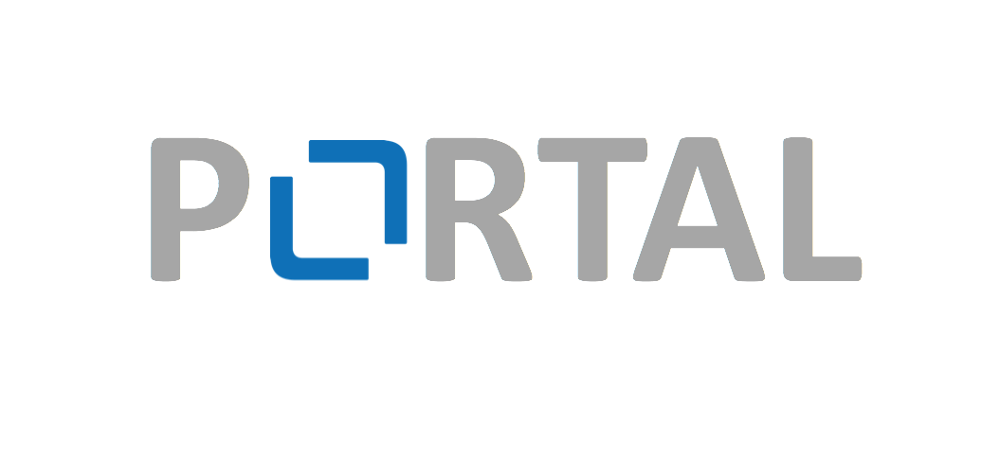
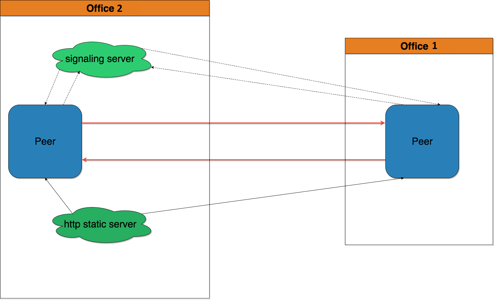

# README #

### Description ###
The **mgm Portal** is an office-to-office video gate that connectes two browser peers using webrtc technology.

### Motivation ###
Even though we now have two offices in Da Nang, we would still like to be able to have an informal communication channel between both locations.

### Structure ###

### Software used ###
* HTML, CSS and JS for frontend
* Python and JS for scripts and simple servers
* SimpleWebrtc | [more info](https://simplewebrtc.com/)
* Signalmaster signaling server | [more info](https://github.com/andyet/signalmaster)
*

### Hardware used ##
* 2x Intel Nuc
* 2x Logitech webcam
* 2x 50" TV

### How do I get set up? ###
1 - Generate ssl Certificates
[run script]

2 - Install chromedriver v.2.31 | [link](https://chromedriver.storage.googleapis.com/index.html?path=2.31/)

3 - Install python dependencies

4 - Setup startup scripts to run on startup of the machine:

### Who do I talk to? ###
Marcello Schreiber (mgm Da Nang intern 28.08.2017 - 22.09.2017)
