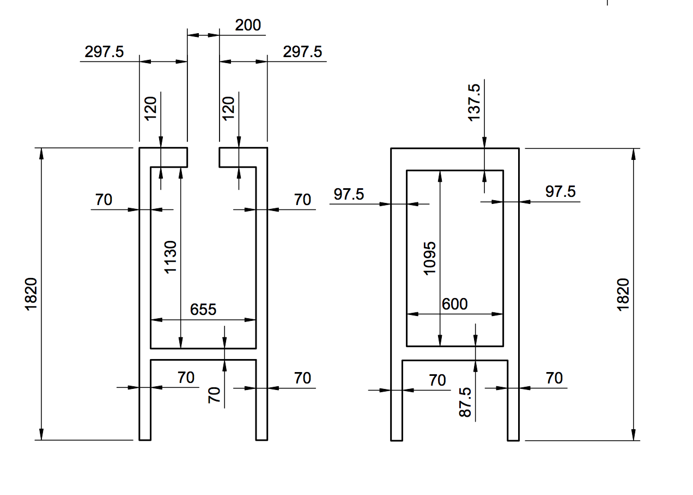

# README #

### Description ###
The **mgm Portal** is an office-to-office video gate that connectes two browser peers using webrtc technology.

### Motivation ###
Even though we now have two offices in Da Nang, we would still like to be able to have an informal communication channel between both locations.

### User Interaction ###
The user can press the enter button to mute/unmute the portal on both sides. If one side is muted/unmuted, the other side will also mute/unmute. In the future the enter button should be substituted by a single big button.

### Structure ###

### Software used ###
* HTML, CSS and JS for frontend
* Python and JS for scripts and simple servers
* SimpleWebrtc | [more info](https://simplewebrtc.com/)
* Signalmaster signaling server | [more info](https://github.com/andyet/signalmaster)
*

### Hardware used ##
* 2x Intel Nuc
* 2x Logitech webcam
* 2x 50" TV
* 2x Rode Videomicro microphone

### How do I get set up? ###

Requirements: NodeJS, Python

1 - Download files and place them in C:/startup/

2 - Install chromedriver v.2.31 | [link](https://chromedriver.storage.googleapis.com/index.html?path=2.31/)
    Observation: newer versions of Chrome will not work without changes because SSL encryption requirements are stricter.

3 - Install python and NodeJS dependencies

4 - Setup startup scripts to run on startup of the machine
    On Windows: press windows key + r and enter "shell:startup". Place the respective startup scripts in that folder:

* Office 1: should run [startupPortal.bat](https://bitbucket.org/mgmportal/mgm-portal/src/16a4c9304311d2815b4b9b2e331c235f9001f0fe/startupScripts/startupPortal.bat),  

[startupSignalingServer.bat](https://bitbucket.org/mgmportal/mgm-portal/src/16a4c9304311d2815b4b9b2e331c235f9001f0fe/startupScripts/startupSignalingServer.bat)

and

[startupStaticHttServer.bat](https://bitbucket.org/mgmportal/mgm-portal/src/16a4c9304311d2815b4b9b2e331c235f9001f0fe/startupScripts/startupStaticHttServer.bat)

* Office 2: should only run [startupPortal.bat](https://bitbucket.org/mgmportal/mgm-portal/src/16a4c9304311d2815b4b9b2e331c235f9001f0fe/startupScripts/startupPorta.bat)

After everything is setup the portal should be working automatically after the setup of the machine.

### Configuration ###
It might be needed to configure:

* microphone
check the windows settings to get the best volume and check if the pc is using the right microphone and not the webcam mic
* webcam
can be adjusted by bending the metal support on the frame

### How to customise the look? ###
mgm Portal is a browser app and can be customised modifying the [CSS](https://bitbucket.org/mgmportal/mgm-portal/src/007fb67ef03d4589b914d3f953db351c3b464932/css/style.css?at=master), [JS](https://bitbucket.org/mgmportal/mgm-portal/src/007fb67ef03d4589b914d3f953db351c3b464932/js/main.js?at=master) and [HTML](https://bitbucket.org/mgmportal/mgm-portal/src/007fb67ef03d4589b914d3f953db351c3b464932/index.html?at=master&fileviewer=file-view-default)
files.

### Static IP Addresses ###
Each portal has a static IP Address assigned to it
* Office Pasteur: 172.31.249.19
* Office mgm2: 172.31.249.18

### The Frame ###

These where the dimensions used to obtain the first frame

These are the recommendations for the second frame. (based on previous experience)

### Links to learn more about WebRTC ###
* [Real-time communication with WebRTC: Google I/O 2013](https://www.youtube.com/watch?v=p2HzZkd2A40)
* [WebRTC in the real world: STUN, TURN and signaling](https://www.html5rocks.com/en/tutorials/webrtc/infrastructure/)

### Practical things we have learnt ###
* The portal should be located such that nobody is continuously being watched
* People do not automatically stay in the right position, so it's a good idea to mark where one should stand.
* The environment tends to be very noisy so we decided to use a directional microphone to eliminate some sound coming from the surroundings.

### Who do I talk to? ###
Lê Hồng Phước ( | mgm Da Nang )
Marcello Schreiber (marcello.schreiber@hotmail.com | mgm Da Nang intern 28.08.2017 - 22.09.2017)
